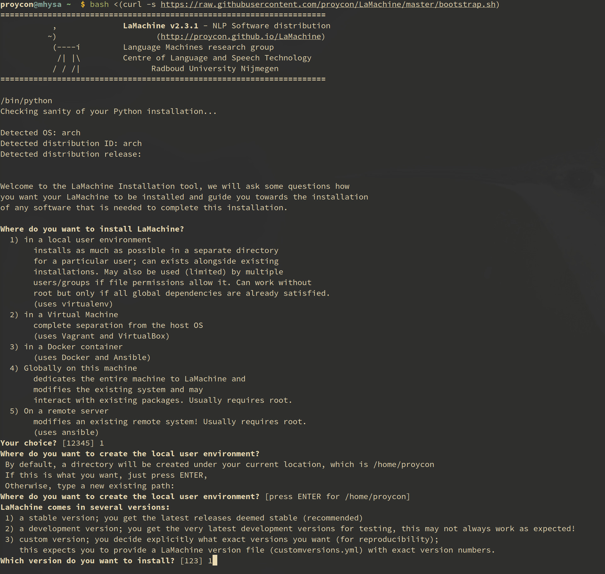
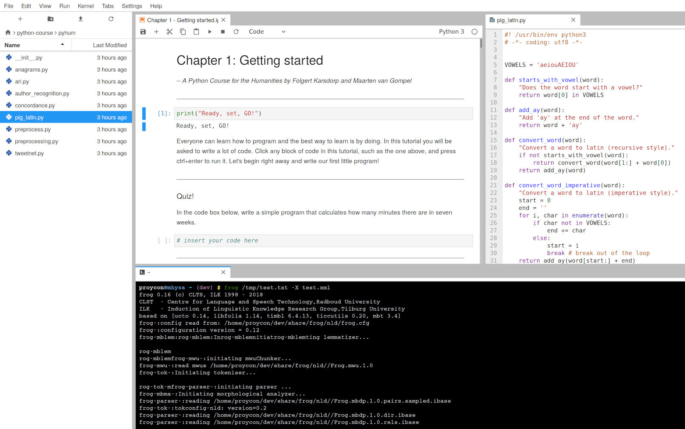
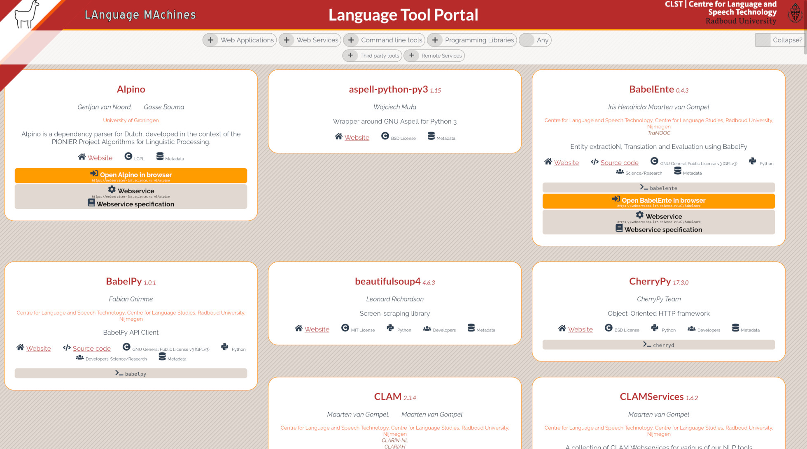

# LaMachine

## Context

* since 2015
* Increasingly complex software stack: Timbl, Frog, ucto, libfolia
* Mostly developed in CLARIN/CLARIAH WP3
* C++ code with dependencies that was non-trivial to compile for most people
* and a stack of Python-based software
* Multiple interfaces and users on each level:
    * command-line interface
    * C++ library / Python bindings
    * RESTful webservice (via [CLAM](https://proycon.github.io/clam))
    * web-application (via CLAM)

## What is LaMachine

A **meta-distribution**:

* A solution for the distribution and deployment of software and software services
* Installation and configuration recipes
* ..for a limited set of (often interconnected) NLP software
* WP3 software stack from Radboud University / KNAW HuC
* No new repository; relies on established software repositories
* Builds on existing technologies
* A fairly standalone infrastructure in the absence of a larger CLARIAH-wide one

## Different "flavours"

Offer a similar environment in different flavours:

- Native, in a local user environment
- Native, globally on dedicated system *(local or remote)*:
    - Linux
    - Windows Subsystem for Linux (limited)
    - macOS (limited)
- As a virtual machine
- As a container

## Technologies

- **Provisioning**  (Installation and configuration recipes):** [Ansible](https://ansible.com)
    - used for all flavours
- **Virtualisation:** Vagrant and Virtualbox
- **Containerisation:**
    1. [Docker](https://docker.com)
        - No need to write your own ``Dockerfile``
        - "Fat" container may be at odds with Docker's paradigm
    2. [LXC](https://linuxcontainers.org)
    3. Singularity

## Target audience

- data scientists / researchers
- developers
- service hosting providers (e.g. CLARIAH centres)
- high-performance computing cluster providers (e.g. universities)

## Target interfaces

- Command-line shell (possibly over ssh)
    - Direct access to installed software
- Web applications (through the browser)
- Web services (REST)
- Web-based IDE and Notebooks (Jupyter Lab)
    - Direct access to isntalled modules

## Target platforms and support levels

* Gold support
    - Debian 10 (buster, stable) *(Docker default)*
    - Ubuntu 20.04 LTS *(VM default, lxc default)*
* Silver support
    - Debian 9 (stretch, oldstable)
    - Ubuntu 18.04 LTS
    - CentOS 8 / RedHat Enterprise Linux 8 -
* Bronze support
    - Debian testing / Debian unstable
    - Ubuntu non-LTS after last LTS
    - macOS (latest version)
    - Arch Linux
    - Linux Mint
    - Fedora Linux

## Bootstrap

* Start from a single executable (shell script) and build a LaMachine environment from scratch (any flavour):
   ``bash <(curl -s https://raw.githubusercontent.com/proycon/LaMachine/master/bootstrap.sh)``
* Start from the latest Docker base image (``Dockerfile``)
* Start from the latest VM image (``Vagrantfile``)

{ height=60% }\

## Development vs Production

Two *channels*:

* **Stable** - Will pull in the latest released 'stable' versions of all software
* **Development** - Will pull in the latest development versions of all software (from git), may break.

## Modularity and Configurability

* LaMachine defines a limited number of *software meta-packages* of participating software
    * (these 'packages' are implemented as ansible *roles*)
* The user decides which to install, packages can be also be added later at will (but not removed)

## Architecture Overview

\

## CLARIAH WP3 Software

* Frog, ucto, libfolia (NLP software for dutch)
    * timbl, mbt
* foliapy, python-frog, python-ucto
* folia tools/utilities
* Deepfrog, folia-rust
* FLAT: FoLiA Linguistic annotation Tool
* PICCL: OCR and OCR post-correction/normalisation
* CLAM: Facilitates building webservices
* Piereling: Webservice for conversion between document formats
* Alpino (Rijksuniversiteit Groningen)

## Software from related projects

* kaldi-nl (Stichting Openspraaktechnologie): Dutch Speech Recognition
* Colibri Core (Radboud University): pattern detection
* T-Scan (Utrecht University): Analytics for dutch texts
* Gecco & Valkuil (Radboud University): Dutch context-sensitive spelling correction

## Third party software

* LaMachine includes (optionally) a lot of third party software common in the field:
    * Jupyter hub/lab/notebooks
    * Tesseract (OCR)
    * pytorch (DL), tensorflow, fasttext
    * Kaldi (ASR)
    * SpaCy (NLP), CoreNLP (Stanford)
    * Moses (SMT)
    * FLAIR , fasttext
    * Nextflow
    * Lots of generic Python libs (numpy, nltk, scikit-learn etc)..
* Common languages: C/C++, Python, JS, R, Go, Rust, Java, Julia

--------------------------

\

## Upgrade procedure

* Running ``lamachine-update`` inside a Lamachine environment will update an
  existing installation and and all software in it
    * (simply invokes ansible again)
* Or pull fresh new image from your image repository (Docker/Vagrant)

## Portal

{ height=50% }\

* Lists all included software and services
* Provides access to included services
* Each LaMachine intstallation can automatically provide such a portal
* Dynamically generated, contents are derived from harvested software metadata
* List is also accessible on command-line through ``lamachine-list``

## CodeMeta as a Software Metadata scheme

*``With codemeta, we want to formalize the schema used to map between the different services (GitHub, figshare, Zenodo) to
help others plug into existing systems. Having a standard software metadata interoperability schema will allow other
data archivers and libraries join in. This will help keep science on the web shareable and interoperable!''*
[ from https://codemeta.github.io ]

**Codemeta**:

- is simple and minimalistic
- aimed at research software and enabling citability (DOI)
- uses Linked Open Data
    - serialises to JSON-LD
    - re-uses and collaborates with schema.org
- is an existing third-party effort, grew out of *Code as a Research Object*, a Mozilla Science project with Github and Figshare
    - provides a mapping to other systems (DOAP, Debian Packages, DataCite, WikiData, Maven, NodeJS, Python distutils, R, Ruby gems)

---------------------------

```json
{
    "@context": [
        "https://doi.org/10.5063/schema/codemeta-2.0",
        "http://schema.org"
    ],
    "@type": "SoftwareSourceCode",
    "identifier": "lamachine",
    "name": "LaMachine",
    "version": "2.24",
    "description": "LaMachine is a unified software distribution for Natural Language Processing. We integrate numerous open-source NLP tools, programming libraries, web-services, and web-applications in a single Virtual Research Environment that can be installed on a wide variety of machines.",
    "license": "https://spdx.org/licenses/GPL-3.0",
    "url": "https://proycon.github.io/LaMachine",
    "author": ...,
    "codeRepository": "https://github.com/proycon/LaMachine",
    "issueTracker": "https://github.com/proycon/LaMachine/issues",
```


## Software Metadata in LaMachine

During installation/bootstrapping/updating, LaMachine:

- Takes the software metadata from each tool's source repository if available
- Otherwise: converts metadata from the upstream package *(Python Package Index, CRAN, CPAN, Maven Central)*
- Augments the metadata where needed with installation/deployment specific information:
    - to register web-based entrypoints as provided by LaMachine
    - with extra information specified in the (Ansible) build recipes
- Builds a software registry of all installed software *(JSON-LD graph)*
- Provides a portal web-application on the basis of this metadata ([Labirinto](https://github.com/proycon/labirinto))
    - Example: https://webservices.cls.ru.nl
- *Note:* CodeMeta describes software metadata, not APIs

## What is LaMachine *NOT*?

- **NOT** an NLP pipeline/workflow system; rather it may install such systems or components required by such systems.
  - *e.g PICCL (powered by Nextflow), Frog
- **NOT** a system for archiving/preserving legacy software
  - software **MUST** be maintained
- **NOT** only for Nijmegen software
- **NOT** a portal to search/access data collections
  - with LaMachine you can bring the tools to the data
- **NOT** a traditional Linux distribution

## Authentication

- LaMachine can be configured to connect to **external** OAuth2/OpenID Connect for authentication.
- Provide the configuration once for all of LaMachine and LaMachine propagates
  it to participating software.
- LaMachine also works fine at the single-user level (or shared)

## Limitations

For service providers, these are explicitly out-of-scope:

- **Scalability**: A single LaMachine installation does not scale for long, you can spin up multiple instances
  in the docker/VM flavour but have to handle the load balancing yourself.
- **Container Orchestration:** LaMachine does not cover multiple containers and does no container orchestration
- **Encryption:** LaMachine does not handle SSL certificates, you need to handle that in your own reverse proxy

-------------------------

For participating software providers:

- Software must remain maintained/up to date, participants must make an effort to support all flavours, target platforms
    and channels
- Software is limited to NLP/Data-science
- LaMachine is **not** a substitute for not providing source repositories or ecosystem packages
- Dependencies may not cause major conflicts between participating software (shared environment)
- No nested containers!

-------------------------

For all:

- **Rolling release** (latest version), limited support for rebuilding older versions
- **Data-agnostic**, does not tie into any large external data collections

[comment]: # But you can store and reuse older images

## Strengths and Weaknesses

**Strengths:**

* Highly **flexible** solution (many flavours, serves many different audiences)
* Does not focus exclusively on a service oriented architecture nor *Software as a Service*
* The software provider needs to know only a subset of Ansible and no specific knowledge of Docker, LXC, Vagrant is
  required.
* Really brings software to the users
* Proven track record; real users
* Builds on standard solutions, propagates software freedom

-------------------------

**Weaknesses:**

- **Complexity & Maintainability**: supporting many target distributions, flavours and channels, in continuously moving
  ecosystems is not easy.
- **Fat containers** may be at odds with the Docker paradigm

